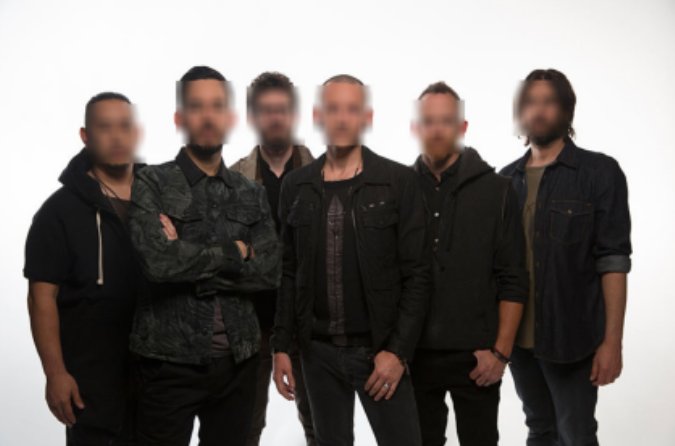

# Face Blurring
  
Face Blurring using various approaches for face detection,
and applying simple blurring process.  

these are the approches used for face detection:
1. haarcascade algorithm 
2. medipipe framework models
3. YuNet model: https://github.com/opencv/opencv_zoo/blob/main/models/face_detection_yunet/face_detection_yunet_2023mar.onnx  

  
